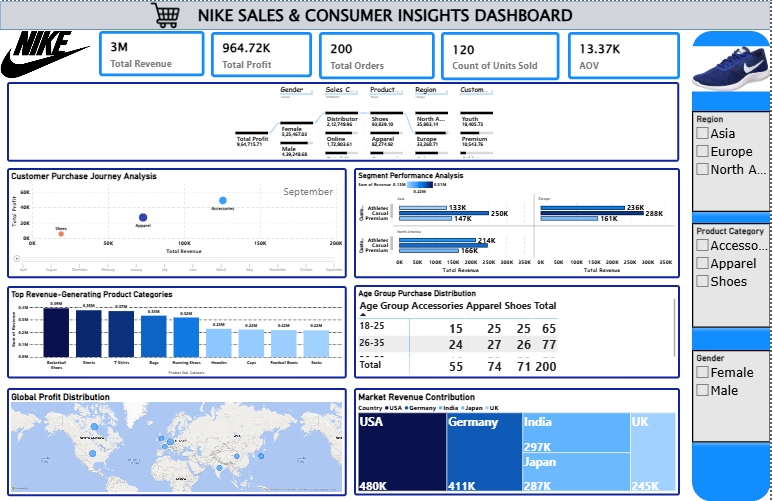

# 👟 Nike Sales & Consumer Insights Dashboard

## 📌 Project Overview

The Nike Sales & Consumer Insights Dashboard is an interactive Power BI solution developed to analyze Nike's global sales performance, customer purchasing behavior, product category performance, and regional market trends. The dashboard transforms sales data into actionable insights using dynamic visualizations and business intelligence techniques.

## 📷 Dashboard Preview

## 🎯 Business Objectives

1. Analyze Nike's overall sales and profitability.
2. Monitor product category performance.
3. Compare regional sales distribution.
4. Evaluate customer purchasing behavior.
5. Analyze customer demographics by gender and age group.
6. Identify high-performing markets and customer segments.
7. Support strategic business decisions through interactive analytics.

## 📊 Key Performance Indicators

| KPI | Value |
| Total Revenue | 3M |
| Total Profit | 964.72K |
| Total Orders | 200 |
| Units Sold | 120 |
| Average Order Value (AOV) | 13.37K |

## 📈 Dashboard Features

 📌 Interactive KPI Cards
 🌍 Regional Sales Analysis
 🛒 Product Category Performance
 👥 Customer Segmentation
 📊 Customer Purchase Journey Analysis
 📈 Revenue by Product Category
 🌎 Global Profit Distribution Map
 🌍 Market Revenue Contribution Treemap
 📋 Age Group Purchase Distribution
 🎛️ Interactive Filters (Region, Product Category, Gender)

## 🛠️ Tools & Technologies

1.Microsoft Power BI
2.Power Query
3.DAX

## 💼 Skills Demonstrated

1. Data Cleaning
2.Data Transformation
3. Data Modeling
4. DAX Measures
5. Dashboard Design
6. Business Intelligence
7. Customer Analytics
8. Sales Analytics
9. Interactive Reporting
10.Data Visualization

## 💡 Key Business Insights

1. Generated a total revenue of **3M** with an overall profit of **964.72K**.
2.Product categories contribute differently to revenue, helping identify high-performing products.
3. Regional analysis highlights variations in sales performance across global markets.
4.Customer segmentation reveals purchasing behavior across different customer groups.
5. Age-group analysis provides insights into the most active customer demographics.
6.The Global Profit Distribution map identifies regions contributing the highest profitability.
7.Market Revenue Contribution highlights the strongest international markets for Nike products.
8.Interactive filters allow users to perform detailed analysis by region, product category, and gender.

## 📂 Repository Contents

| File | Description |
| Nike_Sales_Dashboard.pbix | Power BI Dashboard |
| Dashboard.png | Dashboard Preview |
| Nike_Sales_Dashboard.pdf | PDF Report |
| Nike_Sales_Dataset.xlsx | Source Dataset |

## 🚀 How to Use

1. Download the `.pbix` file.
2. Open it using Microsoft Power BI Desktop.
3. Explore the dashboard using the interactive slicers and filters.
4. Analyze KPIs, regional performance, customer segments, and product insights.

## 📌 Conclusion

This project demonstrates my ability to transform global retail sales data into meaningful business insights using Power BI, Power Query, and DAX. Through interactive dashboards and analytical visualizations, the project supports data-driven decision-making by highlighting sales performance, customer behavior, profitability, and market trends.
